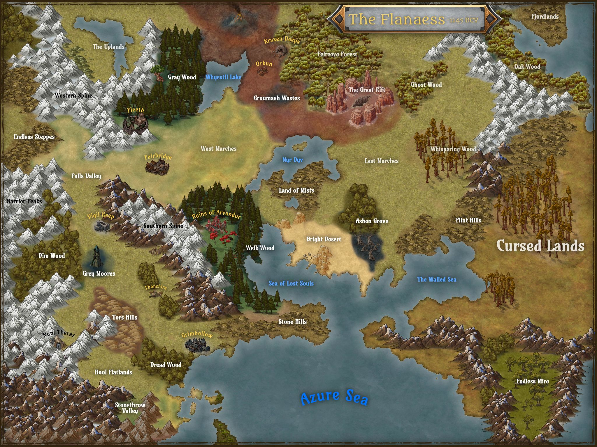
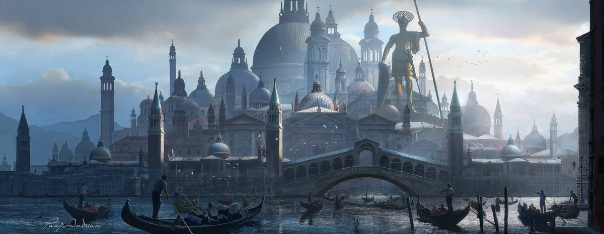
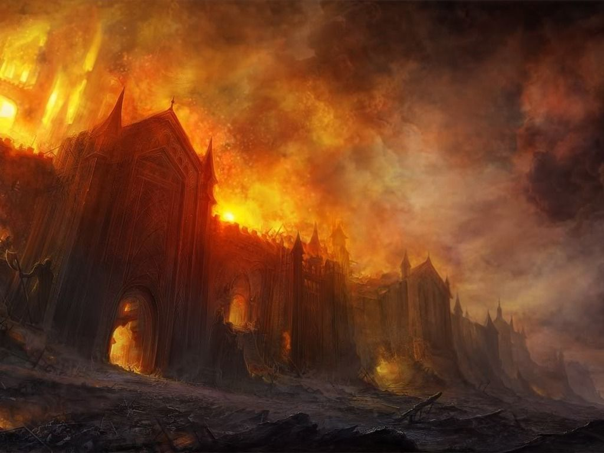

## The Fleeth Empire

{ width=400 align=right }

The Empire proper is bordered on the north by the Gray Woods and Grumash Wastes. It extends throughout the fertile river towns of the Western Marches bordered by the Nyr Dyv to the east. The Welk Woods make up the southeastern border. To the west it extends through the falls valley to the Endless Steppes.

Though not officially represented many of the human settlements to the south of Vigil Keep are Ur-Flan in origin and count their heritage as part of the Fleeth Empire, with many of the same traditions. These hearty humans who push the boundaries of the frontiers have established an infrequent but strong trade with their cousins to the north.

The Empire boast a deepening relationship with the Grey Elves. The elves have established both an embassy and a university in Fleeth. Settlements at the edge of the Grey Wood house several generations of a thriving half-elf community with a balanced approach to usage of the commodities of the wood.

Twice yearly at the Summer and Winter equinox select members of the Empire have enjoyed the hospitality of the Elves at the Great Tree.

Some elvish clans remain secretive and isolated from the larger host, wary of humans. They live isolated, deep in the woods, keepers of lore in beautiful living temples. No more is this true than in the Welk Wood to the south. Though trade and lumber rights have been established the elves of the Welk remain isolated and refuse entry into the heart of the wood.

The Grey Elves will only say that all elves mourn for the loss of Arvandor, their holy city, and cannot bear any to look upon it.

Dwarves are rare in the Western Marches. A few have established themselves as brewers, forgers and shapers. They have a large hold in the Southern Spine bordering the Welk woods, but are otherwise isolated to the valley of Num Theraz.

The hill folk (gnomes and halflings) are found throughout the empire in small groups. They have established larger villages in the Stone and Tors Hills and in the Stone Throw valley.

## The City of Fleeth

{ width=450 align=right }

The City of Fleeth lays along the banks of the River Velverdyva. Its alabaster walls, parapets and towers hark from an era of war when human and orcish invaders were common. The city is beautiful and orderly in its construction with waterways providing access to river ships, springs, fountains and more. The lowest and outermost segment of the city is the trade district.

The Trade District bristles with inns, artisans, shops, markets and more. Here all walks of life mingle as both wealthy and working class spend efforts to bolster trade and industry.

By law all those who live and work in the city must maintain order and equity, including minimums and maximums of weekly wages set by the emperor and his council. Though many more affluent citizens lobby for changes to these rules, they continue to be denied. Many merchant princes and would be nobles thus maintain some property in the city while headquarters and estates lie elsewhere. The wages are often generous as many of the people take it at its spirit rather than its letter.

The Law District is the second tier of the city. Here finer shops, inns, clergy, embassies, minor lords and others have their relatively modest estates. Parcels are awarded here rather than purchased and tend to pass on to family or apprentice. On the rare occasion a scandal and subsequent judgement allow openings for new tenants.

The inner most and highest point of the city is the temple district. None but city guards, judges and the imperial family may live here. Here the palace, more gardens, quiet and contemplation than a lavish estate is dominated by temples and places of the learning. Many buildings serve for both active use, worship and as museums. Walls and plazas sport murals depicting great men and women, ideals, law, balance and other themes common to the Ur-Flan.

The main plaza contains several cuttings and offspring of the golden tree. Though no longer in bloom these trees' golden leaves remain throughout the year. Fruit is rarely found but there are several folk stories of those who have found fruit and have been blessed by the Gods in a time of need.

Temples to Ioun, Moradin and Pelor can be found here along with shrines and statues of the prior including the first emperor and his mother.

Pholtus, the first emperor, is worshiped almost in the same breath as Pelor. In many rituals they are treated as if they are the same person, others provide a distinction of father and son, yet others describe them as unrelated except in purpose. His mother is also revered in this manner, as both a consort to Pelor as Pholtus' father and as another aspect of Pelor.

Despite this confusing doctrine the priests simply smile and say that Pelor is generous and never jealous, his light shines on all. When pressed they compare Pholtus and his mother to two moons. Though they are not the sun, but they do reflect its life giving light and show our way in the darkness.

## The Burning of Fleeth

{ width=400 align=right }

In the year -1187 BCY the City of Fleeth was attacked by a vile necromancer and his legions of undead. The unliving soldiers crawled from the canals, sewers and fountains in nearly every part of the city simultaneously. The counter attack was slow and ineffective, each rally was met by either a new wave of creatures or a vicious attack of fel energies that decimated the guard, and brought fresh troops to the enemy. The dark wizard brought horrible human amalgamations to sack the temple district. The shrine of Pholtus was obliterated and the gates of the temple of Pelor were reduced to ashes. All but the youngest child of the emperor were killed before the clerics were able to rally. The giant horrors and the necromancer were caught by surprise. The dark master was wounded and became desperate to escape. His minions easily destroyed by the purifying light of the Gods.

The empire entered a time of mourning. They dispatching several adventurers to track down and destroy the wounded necromancer. Many of the adventures never returned and the necromancer was never heard from again. In time the city and it's people healed and rebuilt, stronger and more fortified than ever.