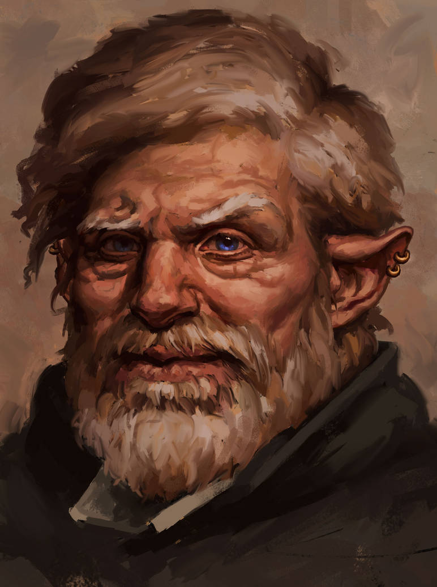

## Queen Yolande

{ width=250 align=left }

Queen Yolande has ivory skin, lilac-colored eyes, and is breathtakingly beautiful. She can trace her lineage all the way to Sehanine Moonbow the elven goddess. It was Sehanine and her children that decided to stay in the Flanaess when the majority of elven kind followed Corellon into the Feywilds. Though some stayed to protect Arvandor most migrated to the Gray Wood.

Shortly after the defeat of Vecna Yolande, along with the High-Priestess of Raven Queen, announced that the period of mourning was over. It was time reclaim Arvandor. Many elvish kin returned from Feylands through forgotten portals. The influx of strange elves combined with their migration across the Western Marches triggered the Zealots of the Inquisition and the Gray Woods were soon invaded.

## Prince Melfus Brightflame

{ width=250 align=left }

Prince Brightflame was dispatched by his cousin Queen Yolande to discover and catalogue the origin of the strange island that fell from the sky. He has joined the expedition as both an advisor and client. 

He is blessed with what the elves call ancient blood, indicating he has an almost indefinite lifespan. Though over 150 years old he doesn't look a day over 40. 

Melfus is an accomplished fighter and archer and is blessed with an extraordinary affinity to magic. Among the elven courts he is regarded as extremely eligible with some say he is a spitting to Corellon in a thousand years.

## Imperial Inquisitor Heleen Santon
{ width=250 align=left }

Heleen Santon is the widow of the late Emperor Frederick Mader. Heleen prior to her marriage was the youngest woman to be appointed High Inquisitor within the Holy Church of the Order.

She held the title of Empress for only a year before her husband's death where he was thrown from his horse and landed poorly. Unfortunately Frederick was the last of the imperial line as Heleen did not produce an heir. 

After a year of mourning Heleen combined and consolidated control of the government and church, turning Fleeth into a religious state. Previously discouraged, any use of magic was outlawed and elves and other non humans were exiled or enslaved.

## The Practical Preacher

There is a rumor of a new religion spreading throughout the West Marches and Falls Valley.

## Ser Keonus of the Vigil

Not much is known about Ser Keonus who rules from Falls Valley to the Grey Moors. Overland trade is not as popular as in days past given the banditry and monster attacks common in the valley. 

He is often called the Law-Giver and the Exact. He and his baron knights command one of the largest armies in the region often skirmishing with orcs, goblins and other creatures.

## Trademaster Bolger Tolman
{ width=250 align=left }

Tolman is an investor and business man out of Fairbridge. He has financed and lost two expeditions to the mist covered island that fell from the sky. He is well connected and deals fairly, though some say is short on mercy.

The first expedition to the island lasted a weak before the encampment was overrun by strange choking mist. The second didn't even make it to dry land as a whirlpool attempted to scuttle both ships.

With the help of Prince Brightflame and a contingency of new recruits he is sure to unlock treasures and great knowledge from the strange place.